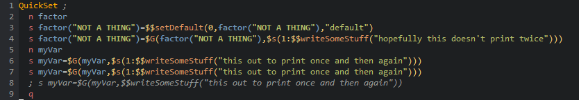

# mparse.nvim



lpeg based parser -> highlighter for m in nvim

Includes a (slower) version of LPEG in this repository. 

I would recommend installing `lpeg` and using that. Install `$ luarocks install lpeg` to use that.

## Install

I would recommend installing lpeg, as it's faster than the shipped pure lua lpeg I have here.

```vim

call plug#begin()

Plug 'tweekmonster/colorpal.vim'
Plug 'tjdevries/mparse.nvim'

call plug#end()
```

### TODO:

- Allow additional parsing rules
  - [ ] For example, parsing headers
  - [ ] Add metadata information about when to highlight and when not to highlight
- "Real-time" highlight
  - [ ] Rate limited
  - [ ] Separate server from this project
- Better highlighting objects
- Allow searching of values within different syntax items
  - [ ] Search for the word "med" only inside of comments
- Flattening of the AST
  - I don't need to have some of the intermediate steps kept in the AST.
  - Might be able to lose them by modifying `token.lua`

## Thanks

Thanks to github.com/siffiejoe/lua-luaepnf. That's where the majority of the `lua/mparse/token.lua` code comes from.

Thanks to github.com/pygy/lulpeg. That's where all of the bundled `./lua/lulpeg` code comes from.
